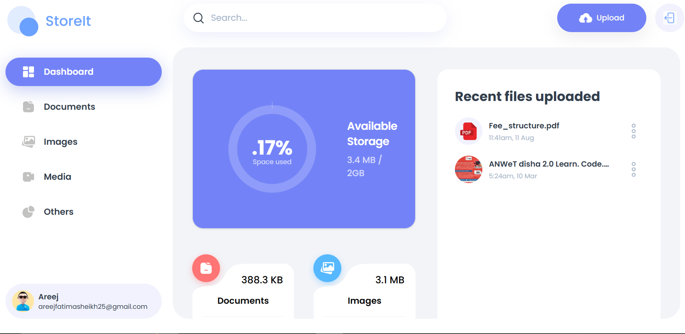
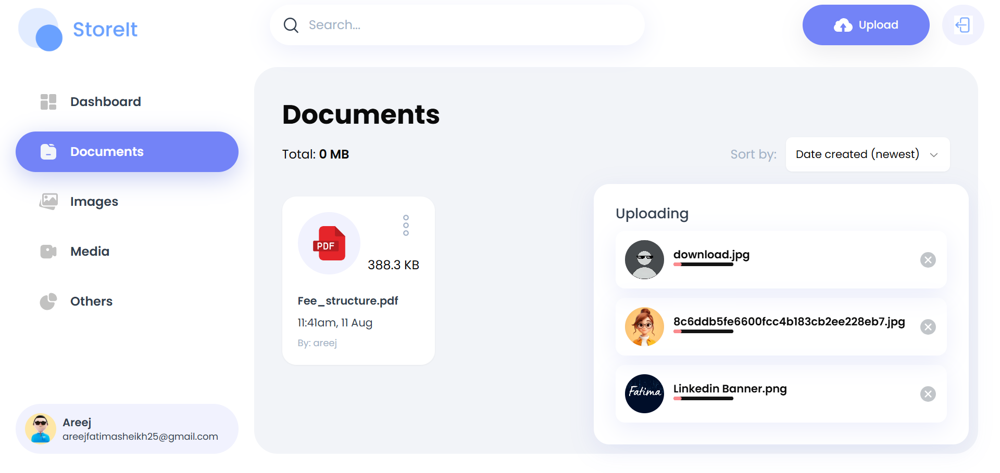

<h1 align="center">📦 Store It</h1>
<h3 align="center">The only storage solution you need — A Cloud Storage and File Sharing Platform</h3>

<p align="center">
  <a href="https://google-drive-clone-zeta.vercel.app/">🌐 Live Demo</a>
</p>

<p align="center">
  
  
  
  
</p>

---

## 🤖 Introduction

**Store It** is a storage management and file sharing platform that lets users effortlessly upload, organize, and share files.  
Built with **Next.js 15**, **React 19**, **Appwrite**, and **TailwindCSS**, it provides a seamless experience for modern file management.

---

## 🚀 Live Demo

👉 Try the deployed app here: [Store It – Vercel Deployment](https://google-drive-clone-zeta.vercel.app/)  

---

## 📸 Screenshots

<p align="center">
  
</p>

<p align="center">
  
</p>


---
## 🎥 Tutorial Video

<video src="assets/Store-It-Tutorial.mp4" controls width="700"  autoplay
       muted
       loop
       controls
       playsinline></video>


---
## ⚙️ Tech Stack

- ⚛️ React 19  
- ⬛ Next.js 15  
- 🟣 Appwrite (Auth, DB, Storage)  
- 🎨 TailwindCSS  
- 🧩 ShadCN  
- 🔵 TypeScript  

---

## 🔋 Features

- 🔐 **User Authentication with Appwrite** – Signup, login, and logout  
- 📂 **File Uploads** – Upload docs, images, videos, and audio  
- 👀 **View & Manage Files** – Rename, delete, preview files  
- ⬇️ **Download Files** – Instant access to stored files  
- 🤝 **File Sharing** – Share files with others seamlessly  
- 📊 **Dashboard Insights** – Storage usage, recent uploads, file types summary  
- 🔍 **Global Search** – Quickly find files and shared content  
- 🗂️ **Sorting Options** – By date, name, or size  
- 📱 **Responsive Design** – Minimal, clean UI across all devices  

---

## 🤸 Quick Start

Follow these steps to set up the project locally.

### 1️⃣ Clone & Install

```bash
git clone https://github.com/username/store-it.git
cd store-it
npm install
